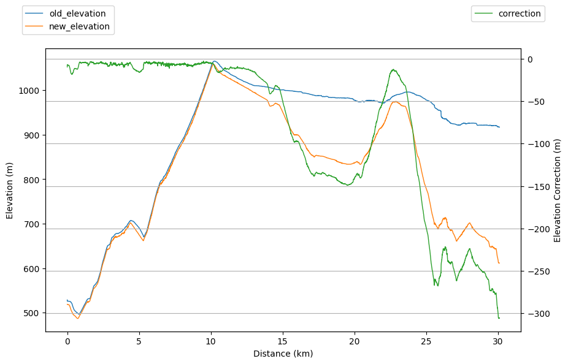
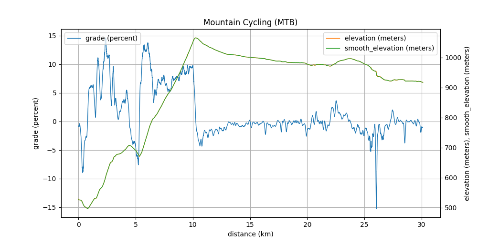
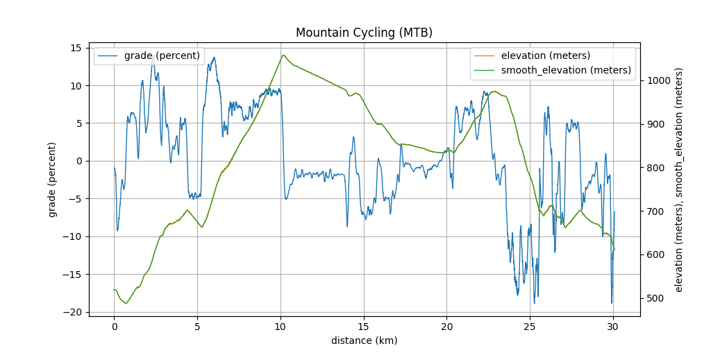
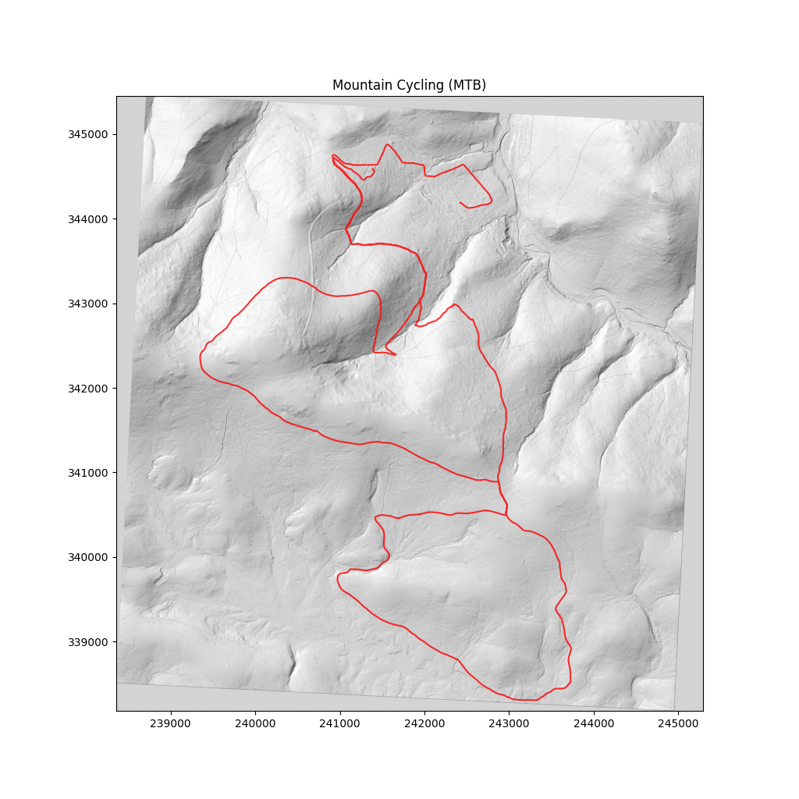

# GPS Tools

[](https://github.com/neri14/gpst/actions/workflows/ci.yml)
[](https://codecov.io/gh/neri14/gpst)
[](https://pypi.org/project/gpst/)

[](https://www.python.org/downloads/)

**GPS Tools** - A collection of tools to work with GPS track files.


## Example Usage

**convert .fit file to .gpx file**

```gpst process track.fit -o track.gpx```


## Detailed Usage

```
$ gpst -h
usage: gpst [-h] [--version] tool ...

GPS Tools - A collection of tools to work with GPS track files.

positional arguments:
  tool        Available tools:
    map       Draw map of input file.
    plot      Plot data from the input file.
    process   Process GPS track file and write results to a GPX file.
    track     Generate a .track file from .fit, .gpx, or .vbo activity data.

options:
  -h, --help  show this help message and exit
  --version   show program's version number and exit
```


### gpst process

```
$ gpst process -h
usage: gpst process [-h] -o OUT_FILE [-y] [--fix-elevation DEM_FILE [DEM_FILE ...]] [--dem-crs DEM_CRS] [--elevation-smoothing-window METERS] [--grade-calculation-window METERS] IN_FILE

positional arguments:
  IN_FILE               Path to input file (.gpx, .fit, .vbo).

options:
  -h, --help            show this help message and exit
  -o OUT_FILE, --output OUT_FILE
                        Path to the output file.
  -y, --yes             Accept questions (e.g. overwrite existing output file).
  --fix-elevation DEM_FILE [DEM_FILE ...]
                        Correct elevation data using DEM files.
  --dem-crs DEM_CRS     Coordinate reference system of the DEM files to be used if no CRS is specified in the files themselves (e.g. 'EPSG:4326').
  --elevation-smoothing-window METERS
                        Smoothing window for elevation data in meters (default: 100).
  --grade-calculation-window METERS
                        Window size for grade calculation in meters (default: 100).
```

Example DEM coordinate reference systems:
- PL-KRON86-NH -> 'EPSG:2180'
- PL-EVRF2007-NH -> 'EPSG:9651'


When `--fix-elevation` is in use, tool produces report in form of csv file and png plot, e.g.:

`$ gpst process track.fit -o ./track.gpx -y --fix-elevation ./dem/*.asc --dem-crs EPSG:2180`

[](./docs/images/elevation_fix_report.png)

<details>
<summary>Elevation Plot without and with --fix-elevation</summary>

**No fix**

[](./docs/images/plot_nofix.png)

**With fix**

[](./docs/images/plot.png)

</details>


### gpst plot

**Note:** plot tool does not calculate additional fields, to use calculated fields with FIT file, convert with process tool to GPX first

```
$ gpst plot -h
usage: gpst plot [-h] -x X_AXIS -y Y_AXIS [Y_AXIS ...] [--y-right Y_AXIS_RIGHT [Y_AXIS_RIGHT ...]] [-t {line,scatter}] [--type-right {line,scatter}] [--width WIDTH] [--height HEIGHT] [-o OUTPUT] FILE

positional arguments:
  FILE                  Path to input file (.gpx, .fit, .vbo).

options:
  -h, --help            show this help message and exit
  -x X_AXIS, --x-axis X_AXIS
                        Field to use for the x-axis.
  -y Y_AXIS [Y_AXIS ...], --y-axis Y_AXIS [Y_AXIS ...]
                        Field to use for the y-axis.
  --y-right Y_AXIS_RIGHT [Y_AXIS_RIGHT ...]
                        Field to use for the y-axis on the right side.
  -t {line,scatter}, --type {line,scatter}
                        Plot type: line, scatter. Default is line.
  --type-right {line,scatter}
                        Plot type for right y-axis: line, scatter. Default is line.
  --width WIDTH         Width of the output image in pixels (default: 2048).
  --height HEIGHT       Height of the output image in pixels (default: 1024).
  -o OUTPUT, --output OUTPUT
                        Path to the output image file. If not provided, shows the plot interactively.
```

Example:

`$ gpst plot ./track.gpx --x-axis distance --y-axis grade --y-right elevation smooth_elevation -o plot.png --width 1024 --height 512`

[](./docs/images/plot.png)

### gpst map

**Note:** map tool does not calculate additional fields, to use calculated fields with FIT file, convert with process tool to GPX first

```
$ gpst map -h
usage: gpst map [-h] [--dem DEM_FILE [DEM_FILE ...]] [--dem-crs DEM_CRS] [--width WIDTH] [--height HEIGHT] [--line-width LINE_WIDTH] [-o OUTPUT] [--show-title] [--trim {tight,box}] FILE

positional arguments:
  FILE                  Path to input file (.gpx, .fit, .vbo).

options:
  -h, --help            show this help message and exit
  --dem DEM_FILE [DEM_FILE ...]
                        DEM files to use as background elevation data.
  --dem-crs DEM_CRS     Coordinate reference system of the DEM files to be used if no CRS is specified in the files themselves (e.g. 'EPSG:4326').
  --width WIDTH         Width of the output image in pixels (default: 4096).
  --height HEIGHT       Height of the output image in pixels (default: 4096).
  --line-width LINE_WIDTH
                        Width of the track line (default: 2.5).
  -o OUTPUT, --output OUTPUT
                        Path to the output image file. If not provided, shows the map interactively.
  --show-title          Show the activity name as the title of the map.
  --trim {tight,box}    Trim the map to the track bounds.
```

Example:

`$ gpst map ./track.gpx --dem ./dem/*.asc --dem-crs EPSG:2180 -o map.png --width 1024 --height 1024 --trim box --line-width 1`

[](./docs/images/map.png)


### gpst track

Generate a race `.track` definition by detecting full laps (finish-to-finish without pit entry/exit crossings) and building a median centerline.

```
$ gpst track -h
usage: gpst track [-h] -o OUT_FILE (--finish-line LAT1 LON1 LAT2 LON2 | --gates-file FILE) [--pit-entry LAT1 LON1 LAT2 LON2] [--pit-exit LAT1 LON1 LAT2 LON2] [--samples N] [--min-lap-points N] [--min-lap-length METERS] [-y] IN_FILE

positional arguments:
  IN_FILE               Path to input file (.gpx, .fit, .vbo).

options:
  -h, --help            show this help message and exit
  -o OUT_FILE, --output OUT_FILE
                        Path to output .track file.
  --finish-line LAT1 LON1 LAT2 LON2
                        Finish gate as 4 values: LAT1 LON1 LAT2 LON2.
  --gates-file FILE     Path to file with [finish_line] and optional [pit_entry]/[pit_exit] sections.
  --pit-entry LAT1 LON1 LAT2 LON2
                        Optional pit entry gate as 4 values: LAT1 LON1 LAT2 LON2.
  --pit-exit LAT1 LON1 LAT2 LON2
                        Optional pit exit gate as 4 values: LAT1 LON1 LAT2 LON2.
  --samples N           Number of points in generated median line (default: 200).
  --min-lap-points N    Minimum points between finish crossings to consider a lap (default: 20).
  --min-lap-length METERS
                        Minimum lap length in meters to consider a lap (default: 50).
  -y, --yes             Accept questions (e.g. overwrite existing output file).
```

Example:

`$ gpst track ./session.vbo -o ./track.track --finish-line 51.05224842382455 16.974045167417728 51.05214967454188 16.974058559964362 --pit-entry 51.052332 16.973482 51.052091 16.973468 --pit-exit 51.052304 16.974400 51.052316 16.974668 -y`

Alternative using a gates file (`.track` format sections are accepted):

`$ gpst track ./session.vbo -o ./track.track --gates-file ./auchan.track -y`


## Limitations

- GPX rte and wpt (and FIT equivalents) are ignored
- track and segment split in GPX (and FIT equivalents) are ignored
- GPX 1.0 is not supported (yet)
- unsupported fields are not preserved (see [list of supported Fields](./FIELDS.md))

- following GPX extensions are utilized for working with GPX files:
  - http://www.garmin.com/xmlschemas/TrackPointExtension/v1
  - http://www.garmin.com/xmlschemas/TrackPointExtension/v2
  - http://www.garmin.com/xmlschemas/GpxExtensions/v2
  - http://www.garmin.com/xmlschemas/GpxExtensions/v3
  - http://www.n3r1.com/xmlschemas/ActivityDataExtensions/v1
